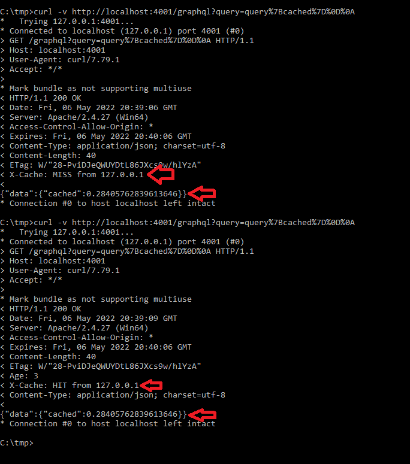
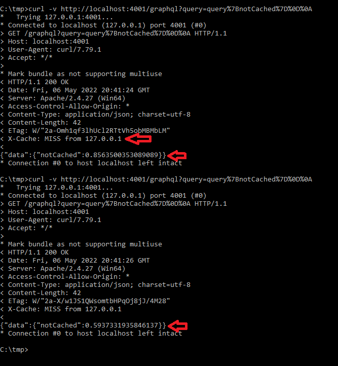

# graphql-cached-get

Simple example to demonstrate that GraphQL requests can be cached.


## Start
```
npm install
npm run start
```
Then start the proxying server:
```
httpd -f c:\apache24\conf\httpd-proxy.conf
```

## Cacheable
`curl -v "http://localhost:4001/graphql?query=query%7Bcached%7D%0D%0A"`

Querying the "cached" node will result in a request that is cached for up
to 60 seconds. The first request you will get a cache miss and a random
number. The second request within 60 seconds you will get a cache hit
and the same random number as the first request.

This is done on the GraphQL server side by using the Expires HTTP header.



## Not cacheable
`curl -v "http://localhost:4001/graphql?query=query%7BnotCached%7D%0D%0A"`

Querying the "notCached" node will result in a request that is never
cached. Every request you will get a new random number.

This is because no Expires HTTP header is emitted.

